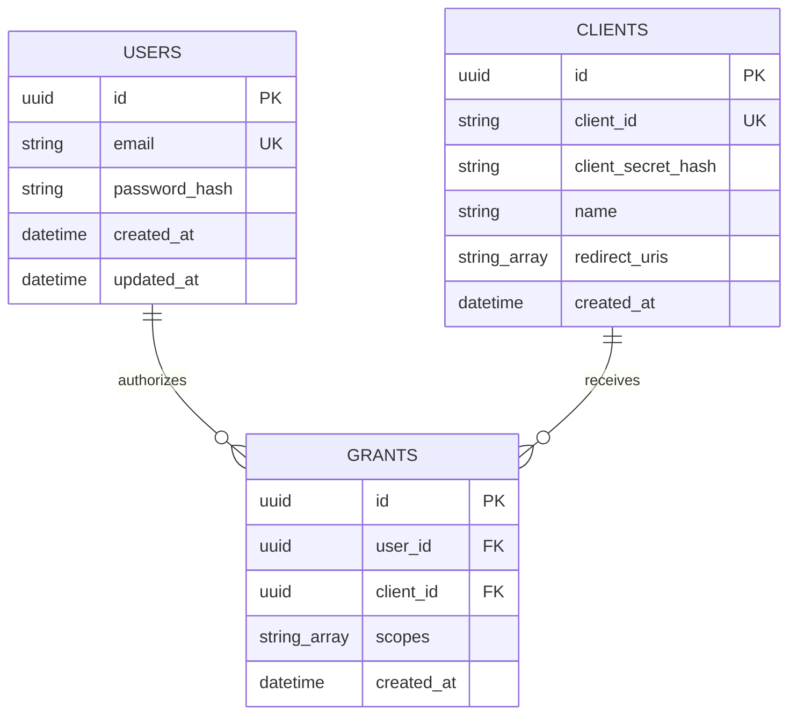

# Document 04: Database Schema and Data Models

## 1. Relational Database Strategy

The Identity Provider relies on **PostgreSQL (v15)** as its primary relational database management system (RDBMS) for persistent data storage. Data interactions are managed through **Prisma ORM (v7)** using the `@prisma/adapter-pg` JavaScript driver connector.

### Key Database Guarantees:
1. **ACID Transactions:** User registration, consent granting, and client updates happen in strict atomic transactions.
2. **Referential Integrity:** Cascading updates and strict foreign key constraints between `users`, `clients`, and `grants`.
3. **Data Security:** Raw passwords and client secrets are **never** persisted. Hashed representations (`password_hash`, `client_secret_hash`) are enforced at the model level.

---

## 2. Entity Relationship Diagram (ERD)



---

## 3. Table Definitions & Models

### 3.1 Users Model (`users`)
Stores core identity credentials for end-users who log into the IdP.

| Field Name | Prisma Data Type | DB Column Name | Constraints / Attributes | Description |
| :--- | :--- | :--- | :--- | :--- |
| `id` | `String` | `id` | `@id`, `@default(uuid())` | Primary key (UUID v4). |
| `email` | `String` | `email` | `@unique` | User email address (indexed). |
| `passwordHash`| `String` | `password_hash`| Required | `bcrypt` hashed password string. |
| `createdAt` | `DateTime` | `created_at` | `@default(now())` | Account creation timestamp. |
| `updatedAt` | `DateTime` | `updated_at` | `@updatedAt` | Automatic timestamp on profile update. |

---

### 3.2 Clients Model (`clients`)
Stores registered third-party applications authorized to make OAuth requests.

| Field Name | Prisma Data Type | DB Column Name | Constraints / Attributes | Description |
| :--- | :--- | :--- | :--- | :--- |
| `id` | `String` | `id` | `@id`, `@default(uuid())` | Internal primary key. |
| `clientId` | `String` | `client_id` | `@unique` | Public identifier used in OAuth requests. |
| `clientSecretHash`| `String` | `client_secret_hash`| Required | `bcrypt` hash of the raw client secret. |
| `name` | `String` | `name` | Required | Friendly application display name. |
| `redirectUris`| `String[]` | `redirect_uris` | Required | Array of allowed OAuth callback URIs. |
| `createdAt` | `DateTime` | `created_at` | `@default(now())` | Application registration timestamp. |

---

### 3.3 Grants Model (`grants`)
Records persistent explicit user authorization given to a specific client app for specified scopes.

| Field Name | Prisma Data Type | DB Column Name | Constraints / Attributes | Description |
| :--- | :--- | :--- | :--- | :--- |
| `id` | `String` | `id` | `@id`, `@default(uuid())` | Primary key. |
| `userId` | `String` | `user_id` | Foreign Key $\rightarrow$ `User.id` | The user who granted consent. |
| `clientId` | `String` | `client_id` | Foreign Key $\rightarrow$ `Client.id` | The client receiving consent. |
| `scopes` | `String[]` | `scopes` | Required | Array of granted scopes (e.g. `['openid', 'profile']`). |
| `createdAt` | `DateTime` | `created_at` | `@default(now())` | Consent creation timestamp. |

---

## 4. Prisma Schema Configuration (`prisma/schema.prisma`)

Below is the complete, active `schema.prisma` configured for Prisma 7:

```prisma
generator client {
  provider = "prisma-client-js"
}

datasource db {
  provider = "postgresql"
}

model User {
  id           String   @id @default(uuid())
  email        String   @unique
  passwordHash String   @map("password_hash")
  createdAt    DateTime @default(now()) @map("created_at")
  updatedAt    DateTime @updatedAt @map("updated_at")

  grants       Grant[]

  @@map("users")
}

model Client {
  id               String   @id @default(uuid())
  clientId         String   @unique @map("client_id")
  clientSecretHash String   @map("client_secret_hash")
  name             String
  redirectUris     String[] @map("redirect_uris")
  createdAt        DateTime @default(now()) @map("created_at")

  grants           Grant[]

  @@map("clients")
}

model Grant {
  id        String   @id @default(uuid())
  userId    String   @map("user_id")
  clientId  String   @map("client_id")
  scopes    String[]
  createdAt DateTime @default(now()) @map("created_at")

  user      User     @relation(fields: [userId], references: [id])
  client    Client   @relation(fields: [clientId], references: [id])

  @@map("grants")
}
```

---

## 5. Indexing & Migration Strategy

### Indexes & Performance Optimizations
* `users(email)`: Unique Index ensures $O(1)$ lookup time during authentication.
* `clients(client_id)`: Unique Index ensures $O(1)$ lookup time when validating OAuth requests.
* `grants(user_id, client_id)`: Composite Index (implicit via foreign keys) speeds up consent checks during the authorization flow.

### Migration Management
All database schema changes are managed via Prisma CLI migrations:
* Command to apply changes in dev: `npx prisma migrate dev --name <migration_name>`
* Production deployment command: `npx prisma migrate deploy`
